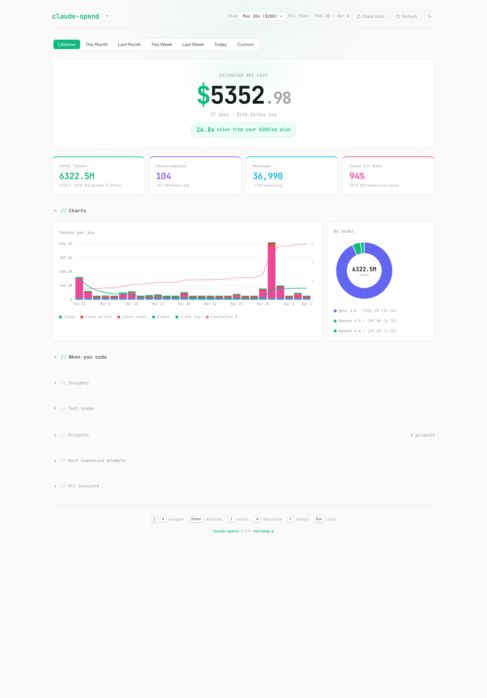

# claude-spend

See where your Claude Code tokens go. One command. Local dashboard. No setup.

```bash
npx @mpalermiti/claude-spend
```



Reads your local Claude Code session data (`~/.claude/`) and shows you exactly where your tokens go. Everything runs locally. Nothing leaves your machine.

## The ROI Multiplier

Your Claude Code subscription hides how much API-equivalent value you're actually using. claude-spend reveals it. Select your plan ($100 or $200/mo), and the dashboard shows your multiplier — how many times over you're getting your money's worth.

> **26.7x** value from your $200/mo plan

This is the stat that makes you feel good about your subscription. And the one your followers will screenshot.

## What's in v3

| Feature | Original | v3 |
|---------|----------|-----|
| Token usage chart | Basic bar chart | Stacked bars + 7-day moving average + cumulative cost line |
| Date filtering | None | 6 presets + custom range |
| Cost estimation | None | Full API-equivalent cost with per-model pricing |
| ROI multiplier | None | Plan-aware, shows Nx value vs subscription |
| Trend comparison | None | Cost/token delta vs previous equivalent period |
| Activity heatmap | None | Hour x day-of-week grid with peak callout |
| Session drill-down | None | Per-turn cost chart, context growth, token breakdown |
| Chart tooltips | None | Hover daily bars and donut for detailed breakdowns |
| Smart insights | None | 12 automated insights (vague prompts, marathon sessions, model waste) |
| Project breakdown | None | Per-project tokens with expandable prompt drawers |
| Tool usage | None | Top 15 tools, ranked color gradient |
| Share card | None | 1200x630 PNG with hero cost, ROI badge, stats |
| Keyboard navigation | None | j/k navigate, Enter drill down, / search, d dark mode |
| Dark mode | None | Full dark theme with CSS variable system |
| MCP server | None | 5 tools — Claude can query its own spend |
| Design | Basic HTML table | Emerald identity, Plus Jakarta Sans + JetBrains Mono, dot grid, micro-interactions |

## Install

```bash
npx @mpalermiti/claude-spend
```

**CLI flags:**

```
--port <port>   Custom port (default: 3456)
--no-open       Don't auto-open browser
--mcp           Run as MCP server (stdio)
--help          Show help
```

## Dashboard Sections

1. **Hero** — API-equivalent cost at a glance, trend delta, ROI multiplier badge
2. **Stat cards** — Total tokens, conversations, messages, cache hit rate (color-coded)
3. **Charts** — Daily stacked bars with 7-day moving average and cumulative cost overlay, model donut with hover tooltips
4. **Activity heatmap** — When you code, hour by day of week
5. **Insights** — Featured top insight + expandable list of 12 automated recommendations
6. **Tool usage** — Horizontal bars showing which tools Claude calls most
7. **Projects** — Per-project token breakdown with expandable prompt details
8. **Most expensive prompts** — Top 20 messages ranked by token usage
9. **All sessions** — Sortable, searchable table with click-to-drill-down
10. **Session drill-down** — Per-turn cost curve, context growth, turn-by-turn token breakdown

## Keyboard Shortcuts

| Key | Action |
|-----|--------|
| `j` / `k` | Navigate sessions |
| `Enter` | Open drill-down |
| `Escape` | Close drill-down / modals |
| `/` | Focus search |
| `d` | Toggle dark mode |
| `r` | Refresh data |

## MCP Server

Add this to `~/.claude/settings.json` and Claude can query spend data during any conversation:

```json
{
  "mcpServers": {
    "claude-spend": {
      "command": "npx",
      "args": ["@mpalermiti/claude-spend", "--mcp"]
    }
  }
}
```

Five tools: `get_spend_summary`, `get_top_sessions`, `get_project_breakdown`, `get_insights`, `get_daily_trend`. All accept optional `from`/`to` date params.

## How It Works

Claude Code writes JSONL session files to `~/.claude/projects/`. This tool parses them, calculates API-equivalent costs per model (with cache write/read pricing), aggregates by day/model/project, and generates insights. The cost numbers represent what the usage would cost at API rates — not what you pay on a subscription. That gap is your ROI.

## Origin

Forked from [claude-spend](https://github.com/writetoaniketparihar-collab/claude-spend) by Aniket Parihar. I kept the core JSONL parser concept, then rebuilt everything else: the dashboard, date filtering, analytics engine, insights, drill-downs, heatmap, share card, keyboard nav, MCP server, and the design. MIT license.
